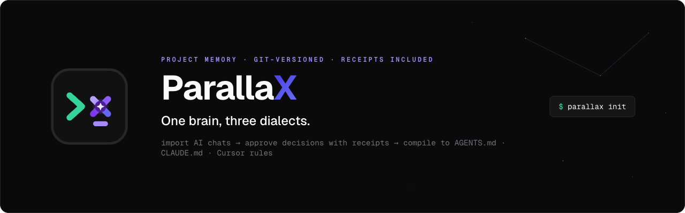

<p align="center">
  
</p>

<p align="center">
  ParallaX is a repo-local, git-versioned <strong>project brain</strong> for handing context between AI tools.
</p>

<p align="center">
  <sub><code>MIT</code> · <code>Node 24.x</code> · <code>mock-first, zero API keys</code></sub>
</p>

---

Its V1 loop is:

```text
chat export -> validated proposal -> explicit apply -> .parallax -> compile
```

Every applied item carries verified, exact evidence from its source chat. The
approved `.parallax/` store is human-editable, git-diffable, and the single
source of truth.

## Status

The V1 core loop is delivered: validated imports with exact evidence and
explicit apply, an approved plain-file store, safe compilation, read surfaces
(MCP, static web, and local UI), and a deterministic mock demo published with
GitHub Pages. GitHub Actions runs the offline `pnpm run check` gate for pull
requests and pushes to `dev`.

Lifecycle editing, persisted proposals, cloud synchronization, and desktop
packaging remain intentionally deferred.

## Setup

Requires Node.js 24.x.

```sh
pnpm install
pnpm run check
pnpm run dev init
```

`init` creates the durable `.parallax/` store. Commit this plain-file,
human-editable project brain to Git. Mock is the safe default and requires no
API key. For live imports, add a local `.env` (gitignored) from the tracked
template, or select a provider and prompt for its key on a TTY:

```sh
pnpm run dev init --env
pnpm run dev init --provider openai --api-key
pnpm run dev init --provider gemini --api-key
pnpm run dev init --provider openai-compatible --api-key
pnpm run dev init --provider claude --api-key
```

`--env` creates `.env` from `.env.example` only when it is absent.
`--api-key` requires an explicit live provider and never accepts the key on the
command line. It prompts securely, writes only `OPENAI_API_KEY`,
`GEMINI_API_KEY`, or `ANTHROPIC_API_KEY`, and sets owner-only permissions where
supported. Existing shell environment variables always take precedence over
`.env`.

### Quickstart

ParallaX supports macOS, Windows, and desktop Linux with Node.js 24.x and a
system browser. The automated CI suite runs on Ubuntu. The fastest read-only
evaluation path is the [public synthetic demo](https://omen-mali.github.io/ParallaX/).

For a complete local verification and the populated browser interface:

```sh
corepack enable
pnpm install --frozen-lockfile
pnpm run check
pnpm run dev ui --root . --store demo/store --mock
```

Browse the tracked `demo/store` without applying imports to it. To exercise the
full import and selected-apply flow, use the ignored demo store instead:

```sh
pnpm run dev init --store .parallax-demo
pnpm run dev ui --store .parallax-demo --mock
```

Mock mode is deterministic, performs no network requests, and requires no API
key. The local UI binds only to `127.0.0.1`; imported content and pending
proposals remain in browser and server memory until an explicitly selected
proposal is applied. See [DEMO.md](DEMO.md) for the tested three-tool scenario
and recording workflow.

## Commands

```text
parallax init
parallax init --env
parallax init --provider openai --api-key
parallax init --provider gemini --api-key
parallax init --provider openai-compatible --api-key
parallax init --provider claude --api-key
parallax import <chat-export>
parallax import <chat-export> --review
parallax import conversations.json --format chatgpt --conversation <id>
parallax import <chat-export> --provider openai
parallax import <chat-export> --provider gemini
parallax import <chat-export> --provider openai-compatible
parallax import <chat-export> --provider claude
parallax compile
parallax serve
parallax web
parallax ui
```

Every store-facing command accepts `--store <path>`. Paths are relative to the
project root (`--root`) and must remain inside it. The default is `.parallax`.
Use an ignored alternate store for demos or exploratory imports:

```sh
parallax init --store .parallax.local
PARALLAX_MOCK=1 parallax import chat.md --apply --store .parallax.local
```

`.parallax/.local/`, `.parallax.local/`, and `.parallax-demo/` are local-only
and ignored. The canonical `.parallax/` store—including `sources/`—is tracked
so evidence remains independently verifiable. Imports retain their normalized
source transcript by default. For sensitive material, use `--metadata-only` to
store source metadata without transcript text, or use an ignored local store.
ParallaX never silently changes the retention choice.

The importer supports deterministic mock extraction, OpenAI Responses, Gemini
Interactions, OpenAI-compatible Chat Completions (custom `baseUrl` via local
preset only), and Claude Messages. Every provider is constrained by a portable
JSON Schema, validated again locally with Zod, and then checked against exact
transcript quotes. Mock extracts only explicit line-level markers:

```md
## User

Decision: Use a plain-file store
Task: Add evidence validation
Question: Should MCP write data?
Term: provenance - exact supporting chat text
Spec: revise | Demo publishing | Commit the generated static page with the fixture store
```

```sh
pnpm run dev init
PARALLAX_MOCK=1 pnpm run dev import chat.md
PARALLAX_MOCK=1 pnpm run dev import chat.md --apply
PARALLAX_MOCK=1 pnpm run dev import chat.md --review
```

An import without `--apply` or `--review` prints a preview and writes nothing.
`--apply` remains the noninteractive option for scripts and applies the full
verified proposal. `--review` is an interactive, TTY-only alternative: it
displays stable item keys such as `d1`, `t2`, and `q1`, accepts a
comma-separated selection, then asks for final confirmation before writing the
selected items. It cannot be combined with `--apply`.

Selection and confirmation happen in the same distillation session, so the
proposal is never saved for later review and no second model call is needed.
An empty selection or declined confirmation writes no source or records.
`--metadata-only` also applies to an approved reviewed import.

For a live import, set the matching key and select the provider explicitly:

```sh
pnpm run dev import chat.md --provider openai
pnpm run dev import chat.md --provider gemini
```

Use `--model <name>` or `PARALLAX_MODEL` to override the provider default.
`PARALLAX_PROVIDER` can select a provider without a CLI flag. Mock remains the
only guaranteed zero-cost path; no live provider is assumed to be free.

### Chat export formats

Generic Markdown is the default import format and works with transcripts that
use role headings such as `## User` and `## Assistant`. Extracted ChatGPT
exports are also supported without adding a ZIP dependency:

```sh
parallax import conversations.json --format chatgpt --conversation <id>
```

Pass the extracted `conversations.json` file, not the export ZIP. A
multi-conversation export requires `--conversation <id>`; when it is omitted,
ParallaX lists a short set of available IDs and titles without importing any
conversation. The selected conversation follows its final parent chain,
preserves supported text turns and roles, and ignores unsupported non-text
content. Generic Markdown remains available as the fallback for other exports,
including Claude-style transcripts.

### Provider capabilities

| Provider            | Protocol                     | Structured output                  | Storage          | Cost                                |
| ------------------- | ---------------------------- | ---------------------------------- | ---------------- | ----------------------------------- |
| `mock`              | Deterministic markers        | N/A (local)                        | N/A              | Always free                         |
| `openai`            | OpenAI Responses API         | Portable JSON Schema (`strict`)    | `store: false`   | Paid; not used in CI                |
| `gemini`            | Gemini Interactions API      | Portable JSON Schema subset        | `store: false`   | Free-tier may apply; not used in CI |
| `openai-compatible` | Chat Completions (`baseUrl`) | Portable JSON Schema (`strict`)    | Endpoint-defined | Endpoint-dependent; not used in CI  |
| `claude`            | Anthropic Messages API       | `output_config.format` JSON Schema | Provider-managed | Paid; not used in CI                |

The model-facing schema is a lowest-common-denominator JSON Schema: Gemini-
unsupported keywords such as `minLength` and `pattern` are stripped before the
request. `ImportDeltaSchema` remains the authoritative local validator, so empty
strings and invalid IDs/tags are still rejected after the provider responds.

Live provider failures are mapped to sanitized error categories without
attaching SDK causes, API keys, prompts, transcripts, or raw response bodies:

- `provider_auth`
- `provider_model_unavailable`
- `provider_rate_limit`
- `provider_refusal`
- `provider_malformed_output`
- `provider_unavailable`

An optional ignored preset can live at
`<store>/.local/providers.yaml`. It contains environment variable names, never
key values:

```yaml
provider: gemini
model: gemini-3.5-flash
apiKeyEnv: GEMINI_API_KEY
```

OpenAI-compatible endpoints require a YAML `baseUrl` (no CLI/env base URL in
V1) and an explicit model via the preset, `--model`, or `PARALLAX_MODEL`. The
endpoint receives the transcript and may retain it under its own policy; ParallaX
makes no retention guarantee for compatible providers:

```yaml
provider: openai-compatible
model: some-model
baseUrl: https://api.example.com/v1
apiKeyEnv: OPENAI_API_KEY
```

Configuration precedence is CLI, environment, local preset, then safe mock
defaults. ParallaX never infers a provider from whichever API key is present.
Selecting `mock` never loads OpenAI, Gemini, OpenAI-compatible, or Claude SDK
clients. `claude` and `openai-compatible` require an explicit model via the
preset, `--model`, or `PARALLAX_MODEL`.

### Gated Gemini live smoke

`pnpm test` and `pnpm run check` stay offline and never call live providers.
For one explicitly gated Gemini smoke request (preview + apply in a temporary
store):

```sh
PARALLAX_GEMINI_LIVE_SMOKE=1 GEMINI_API_KEY=... pnpm run smoke:gemini
```

Optional: `PARALLAX_MODEL=<model>` to control free-tier model availability.
The harness loads the repo `.env` without printing values, refuses to start
without both the gate flag and `GEMINI_API_KEY`, and is excluded from normal CI.

### Gated OpenAI-compatible live smoke

For one explicitly gated openai-compatible smoke (writes a temp
`.local/providers.yaml` with `baseUrl` + explicit model, then one import):

```sh
PARALLAX_COMPATIBLE_LIVE_SMOKE=1 \
  PARALLAX_COMPATIBLE_BASE_URL=https://api.example.com/v1 \
  PARALLAX_COMPATIBLE_MODEL=some-model \
  OPENAI_API_KEY=... \
  pnpm run smoke:compatible
```

Optional: `PARALLAX_COMPATIBLE_API_KEY_ENV` to select a non-default key variable.
`baseUrl` must be http(s) without embedded credentials. Transcript
retention/storage is endpoint-defined; ParallaX makes no retention guarantee.
Excluded from `pnpm test` and `pnpm run check`.

### Gated Claude live smoke

```sh
PARALLAX_CLAUDE_LIVE_SMOKE=1 ANTHROPIC_API_KEY=... PARALLAX_MODEL=claude-sonnet-4-5 \
  pnpm run smoke:claude
```

Uses one Messages request with portable JSON Schema via `output_config.format`.
Excluded from `pnpm test` and `pnpm run check`.

`compile` writes concise, approved context into safe managed blocks in
`AGENTS.md`, `CLAUDE.md`, and `.cursor/rules/parallax.mdc`. It refuses malformed
or duplicated markers and preserves every byte outside the managed block.

`web` generates one self-contained project-brain explorer (`docs/index.html`
by default, overridable with `--out`) that works from a local file or on
static hosting. It embeds a read-only snapshot of approved decisions, tasks,
questions, glossary terms, spec changes, and stored evidence, and supports
client-side search and filtering with no network calls. `serve`
starts a read-only MCP stdio server with `get_context`, `search`,
`get_decision`, and `list_tasks` tools.

### Local UI

`ui` starts a local browser interface for the same approved store used by the
CLI. It binds only to `127.0.0.1` on a temporary port and opens the system
browser. It is not a hosted service and it does not synchronize data anywhere.

```sh
PARALLAX_MOCK=1 pnpm run dev ui
pnpm run dev ui --root /path/to/project --store .parallax.local
pnpm run dev ui --provider openai --model gpt-5.6
```

To inspect the populated synthetic sample instead of your project store, run:

```sh
PARALLAX_MOCK=1 pnpm run dev ui --root . --store demo/store
```

`demo/store` is generated and tracked for demonstration. Browse it freely, but
do not apply imports there unless you intend to regenerate it with
`pnpm run demo:build`.

The UI reads generic Markdown and extracted ChatGPT `conversations.json`
exports from a browser file picker or pasted text. A ChatGPT export with
multiple conversations requires an explicit browser selection. Imported text
is held only in browser and server memory while it is reviewed; it is limited
to 25 MiB per request and is never written until the user selects verified
items and confirms the apply operation. A new preview replaces the prior
in-memory proposal.

The browser can choose a provider and model for a preview, using the same
server-side provider resolver as the CLI. API keys, key environment variable
names, compatible-provider base URLs, and local presets never enter the
browser. Passing `--mock` or setting `PARALLAX_MOCK=1` locks the UI to mock
mode for that launch, so browser controls cannot trigger a live provider. The
UI starts with a fresh 32-byte session capability in the launch URL fragment
and requires it for every API call. It stays out of browser storage and
cookies, and is not printed if browser launch fails. The UI offers only
approved-store browsing, selective import apply, and
constrained compile targets. Record editing, proposal persistence, cloud sync,
and desktop packaging remain outside V1.

`web` remains different: it generates a portable, read-only static snapshot
for a local file or public hosting. The `ui` command always reads the current
local `.parallax` store instead.

### Deterministic demo and GitHub Pages

The tracked demo is generated only from deterministic mock fixtures and never
needs an API key or network access:

```sh
pnpm run demo:build
pnpm run demo:check
```

`demo:build` regenerates the owned `demo/store/` fixture store and
`demo/site/index.html`. Do not hand-edit either generated output. `demo:check`
rebuilds in a temporary location and fails if the tracked demo store or page
has drifted from its fixtures. The separate `docs/index.html` path remains the
default user-owned output of `parallax web`.

The Pages workflow publishes `demo/site/` only for pushes to `dev`. Before its
first deployment, the repository owner must open **Settings > Pages** and
choose **GitHub Actions** as the publishing source. The workflow uses GitHub's
[custom Pages workflow](https://docs.github.com/en/pages/getting-started-with-github-pages/using-custom-workflows-with-github-pages)
artifact upload and deployment steps.

## Built with Codex and GPT-5.6

Codex with GPT-5.6 was the planning and implementation collaborator throughout
the V1 build. The primary Plan-Execute session was used to inspect the existing
repository before each milestone, make implementation decisions, write and
refactor TypeScript, diagnose CI and generated-artifact failures, and review
the final diffs before the user committed them.

That collaboration produced the shared application-service layer, exact
evidence verification, TTY selected-item review, the authenticated loopback
UI, deterministic demo generation, and offline release CI. Focused regression
tests were added whenever review found an edge case, including proposal replay,
concurrent previews, browser-launch failure, mock-mode network isolation, and
generated-page drift. The user reviewed each milestone before staging and kept
the approved `.parallax` store, rather than model output, as the project source
of truth.

The required `/feedback` Session ID is supplied directly in the hackathon
submission and is intentionally not committed to the repository.

## License

[MIT](LICENSE)
